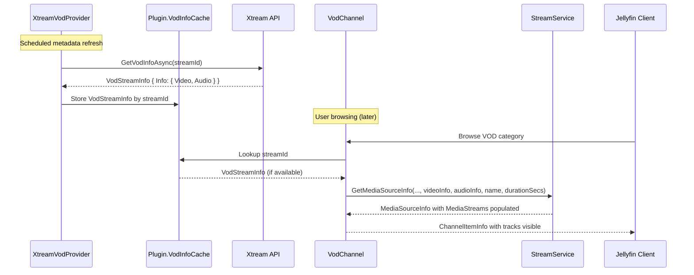

# Design: VOD Media Streams

## Overview

VOD movies currently lack video/audio track information because `VodChannel.CreateChannelItemInfo()` calls `GetMediaSourceInfo()` without `videoInfo` or `audioInfo` parameters. The SeriesChannel does this correctly because it has episode-level `VideoInfo`/`AudioInfo` from the `SeriesStreamInfo` response at browse time.

For VOD, fetching per-item details at browse time is too slow (one API call per movie in a category). Instead, `XtreamVodProvider` already fetches `VodStreamInfo` (with `VideoInfo` and `AudioInfo`) during scheduled metadata refresh. The fix: cache this data so `VodChannel` can use it when building channel items.

## Architecture

**Cache-based approach**: XtreamVodProvider populates a `ConcurrentDictionary<int, VodStreamInfo>` during metadata refresh. VodChannel reads from this cache at browse time to pass video/audio info to `GetMediaSourceInfo()`.

This avoids N+1 API calls at browse time while still providing track info after the first metadata refresh cycle.



## Components and Interfaces

### Plugin.cs (Modified)

Add a `ConcurrentDictionary<int, VodStreamInfo>` property to cache VOD info fetched during metadata refresh.

```csharp
/// <summary>
/// Gets the cache of VOD stream info populated during metadata refresh.
/// Used by VodChannel to build MediaSourceInfo with video/audio track details.
/// </summary>
public ConcurrentDictionary<int, VodStreamInfo> VodInfoCache { get; } = new();
```

### XtreamVodProvider.FetchCoreAsync (Modified)

After fetching `VodStreamInfo`, store it in `Plugin.Instance.VodInfoCache`:

```csharp
VodStreamInfo vod = await xtreamClient.GetVodInfoAsync(Plugin.Instance.Creds, id, cancellationToken).ConfigureAwait(false);

// Cache for VodChannel to use when building MediaSourceInfo
Plugin.Instance.VodInfoCache[id] = vod;

VodInfo? i = vod.Info;
if (i is null)
{
    logger.LogWarning("VOD stream {Id}: Info is null, skipping media stream population", id);
    return ItemUpdateType.None;
}
// ... existing metadata logic unchanged ...
```

Also wrap the `GetVodInfoAsync` call in try/catch to handle exceptions gracefully.

### VodChannel.CreateChannelItemInfo (Modified)

Look up cached VodStreamInfo and pass video/audio info to `GetMediaSourceInfo()`:

```csharp
private static ChannelItemInfo CreateChannelItemInfo(StreamInfo stream)
{
    // ... existing name/date parsing unchanged ...

    // Check cache for detailed VOD info from metadata refresh
    VideoInfo? videoInfo = null;
    AudioInfo? audioInfo = null;
    int? durationSecs = null;

    if (Plugin.Instance.VodInfoCache.TryGetValue(stream.StreamId, out VodStreamInfo? vodInfo)
        && vodInfo.Info is VodInfo info)
    {
        videoInfo = info.Video;
        audioInfo = info.Audio;
        durationSecs = info.DurationSecs;
    }

    List<MediaSourceInfo> sources =
    [
        Plugin.Instance.StreamService.GetMediaSourceInfo(
            StreamType.Vod,
            stream.StreamId,
            stream.ContainerExtension,
            durationSecs: durationSecs,
            videoInfo: videoInfo,
            audioInfo: audioInfo,
            name: stream.Name)
    ];

    // ... rest unchanged ...
}
```

### StreamService.GetMediaSourceInfo (Modified - SupportsProbing logic)

Update the `SupportsProbing` logic so that VOD/Series items with populated MediaStreams disable probing:

Current logic:
```csharp
bool shouldProbe = isLive ? !hasLanguageTracks : true;  // Always true for VOD
```

New logic:
```csharp
bool hasMediaStreams = mediaStreams.Any(s => s.Type == MediaStreamType.Video || s.Type == MediaStreamType.Audio);
bool shouldProbe = isLive ? !hasLanguageTracks : !hasMediaStreams;
```

When we have video/audio streams populated from the API, we trust that data and skip remote FFprobe (which often times out on remote streams).

## Data Models

No new data models. Existing models used:

- `VodStreamInfo.Info.Video` → `VideoInfo` (codec, resolution, aspect ratio, color)
- `VodStreamInfo.Info.Audio` → `AudioInfo` (codec, channels, sample rate, bitrate)
- `VodStreamInfo.MovieData` → `StreamInfo` (name, container extension)

The cache key is the stream ID (`int`), and the value is the full `VodStreamInfo` response.

## Error Handling

| Scenario | Behavior |
|----------|----------|
| `VodStreamInfo.Info` is null | Log warning, skip media stream population, don't cache useful info |
| `GetVodInfoAsync` throws | Log error with stream ID, continue refresh without crashing |
| Cache miss in VodChannel | Build MediaSourceInfo without video/audio (current behavior), SupportsProbing=true |
| VideoInfo codec is null/empty | `GetMediaSourceInfo` already skips video MediaStream |
| AudioInfo codec is null/empty | `GetMediaSourceInfo` already handles — falls to language parsing or no audio |

## Testing Strategy

No automated tests per user specification. Manual verification:

1. Run metadata refresh, check logs for "Cached VOD info" entries
2. Browse VOD category, verify detail pages show video/audio tracks
3. Confirm playback works without FFprobe timeout (check logs for absence of probe attempts)

### Logging Points

- **XtreamVodProvider**: Info log when caching VOD info with video/audio details
- **XtreamVodProvider**: Warning when `VodStreamInfo.Info` is null
- **XtreamVodProvider**: Error when `GetVodInfoAsync` throws
- **VodChannel**: Debug log when cache hit provides video/audio info
- **VodChannel**: Debug log when cache miss (no enriched data available)
- **StreamService**: Debug log for SupportsProbing decision when mediaStreams are present
